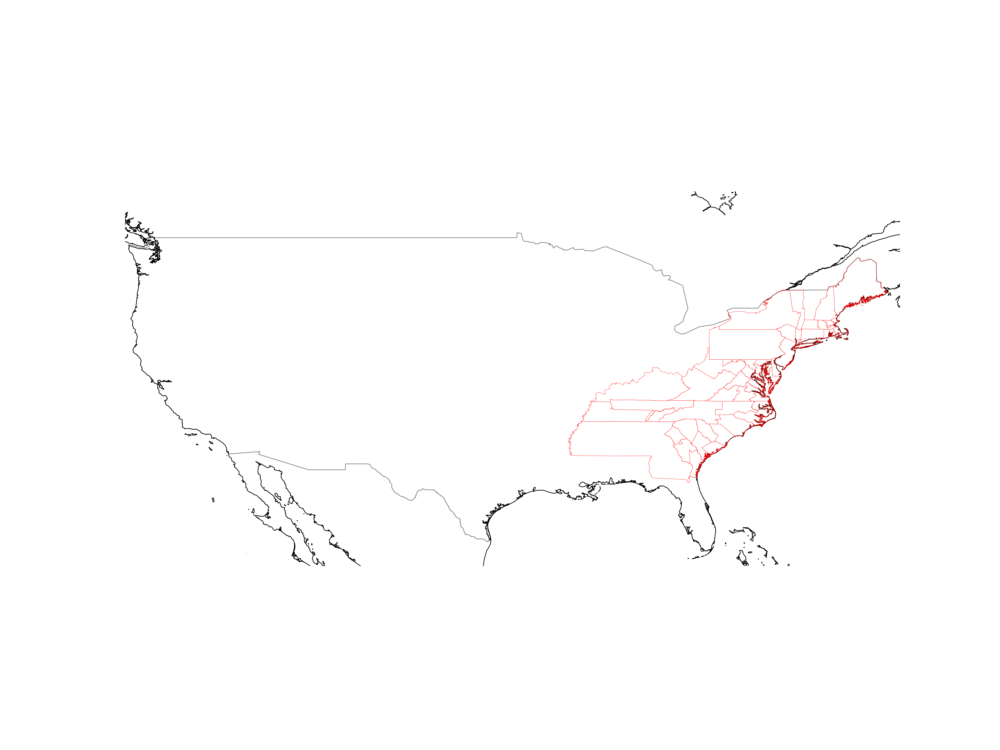

## How to use.

- Setup a Python venv.
- Install the requirements in requirements.txt into it (for example: pip -r requirements.txt)
- Get the shapefiles from the source above, and extract the zip. 
- Run `python congmaps.py --shapefile <path to shapefile> --outfile <path to output file>`
- The output file will be in the same directory as the input file.

## Data Sources

Get [shapefiles from UCLA](https://cdmaps.polisci.ucla.edu/).

I've included the ones from the first congress, which is used in the example. But if you want anymore,
go and get them from the source above.

## Example

```shell
$ python congmaps.py --shapefile districtShapes/districts001.shp --outfile congress-districts.png
```

Should produce the the following image, which is the first congress.



## Other options.

If you want to change the scale of the output, you can do so with the `--scale` option.

If you want to change the output format, name your output file with the appropriate extension, and if it is a supported format by matplotlib, it will be used.

## History

This was a hacky tool written for a friends presentation, that I tidied up and posted here because of this [tweet](https://x.com/jayforeman/status/1807882659072254448) from [Jay Foreman](https://www.youtube.com/JayForeman).